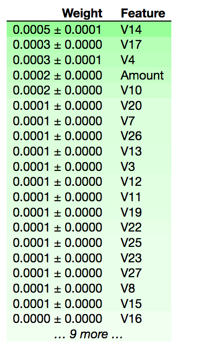

# What is this
This repo contains code for evaluating performance of random forests to detect credit card fraud on Kaggle dataset - https://www.kaggle.com/isaikumar/creditcardfraud

# Why pick credit card fraud
This dataset is highly imbalanced - very low number of true positives. This is a good study in how to deal with imbalances in data on real world datasets.

# Results
Vanilla random forests with no feature engineering achieves 95percent precision with 98 percent recall. This in itself is a very good result, so we spend sometime using permutation importances to explain this model.
First we use F1Score to rank features using permutation importance. 

F1scores are not very discriminative in this case as can be seen from the very small scores and deviations.
So we isolate precision and recall separately. Features with high scores in the precision table are the ones that trigger the model.
Of these features ones that have high scores in the recall table are the ones that increase discriminative power since they keep false positive rate low.

The transaction Amount has a high score which is not surprising. Model is very sensitive to features V14, V7 and V4. Since this dataset is annonymized, we can't really tell what these features are.

We see here that V26 has a high score. This feature also has a high score in the precision table. This means that its helps in discriminative power and also triggers the model.
But this is not the case for V14. This feature has high score in precision table but low in recall, meaning that although this feature triggers the model it does not help much in keeping the false positive rate low.
Taking this feature out will reduce the precision. So this probably hints at the fact that the model uses V14 (and others) to first isolate transactions that it thinks are false and then uses features like V26 to give the final verdict.
